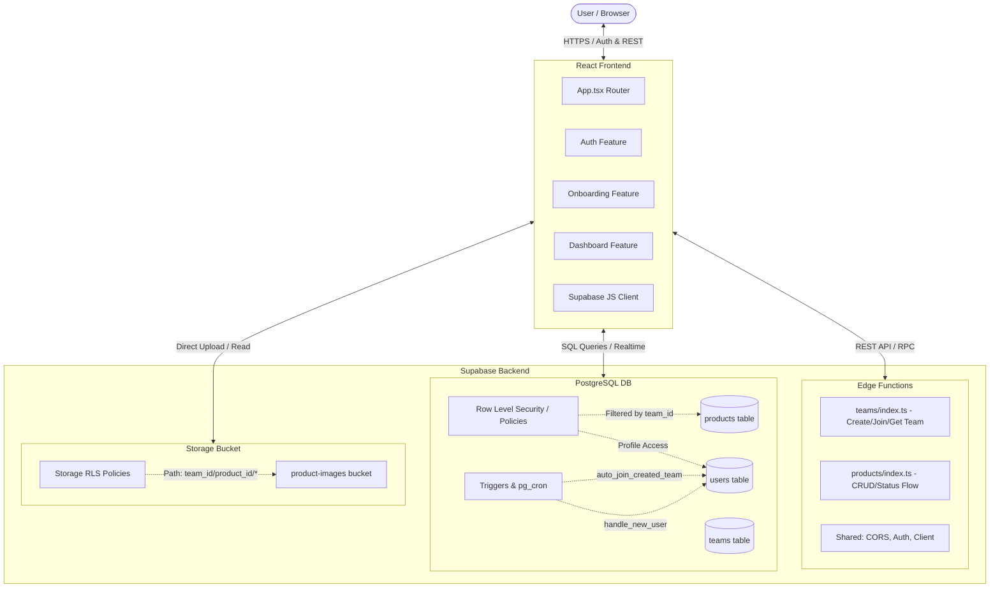

# Supabase Team SaaS Test Project

This project is a multi-tenant web application for team-based product management. The system is built with **Supabase** (PostgreSQL database, authentication, storage, and Edge Functions) on the backend and **React + TypeScript + Vite + Tailwind CSS** on the frontend.

This document provides a detailed overview of the system architecture, directory structure, and instructions for local setup and running.

---

## 🗺️ Architecture Overview

The diagram below illustrates the interaction between system components and data isolation at the database level:



---

## 📁 Directory Structure

The project is split into two primary directories: [supabase](file:///Users/admin/Development/projects/supabase-test/supabase) (backend) and [web-app](file:///Users/admin/Development/projects/supabase-test/web-app) (frontend).

```text
supabase-test/
├── supabase/                    # Backend powered by Supabase
│   ├── config.toml              # Global configuration for local Supabase instance
│   ├── migrations/              # SQL migrations (schema, triggers, RLS)
│   └── functions/               # Supabase Edge Functions (Deno / TypeScript)
│       ├── _shared/             # Common helpers (CORS, Auth, DB Client)
│       ├── teams/               # Team management endpoints
│       └── products/            # Product management endpoints (CRUD, filtering)
│
├── web-app/                     # Frontend application (React, Vite, TS)
│   ├── src/
│   │   ├── features/            # Feature-Based Architecture modules
│   │   │   ├── auth/            # Sign up / Log in flow
│   │   │   ├── onboarding/      # Team creation or joining workflow
│   │   │   └── dashboard/       # Main workspace: products list, filters, management
│   │   ├── shared/              # Reusable shared resources
│   │   │   ├── components/      # UI components (shadcn/ui, buttons, etc.)
│   │   │   ├── hooks/           # Shared React hooks (e.g., useAuthSession)
│   │   │   ├── supabase/        # Supabase JS SDK client setup
│   │   │   └── types/           # Global TS types
│   │   ├── App.tsx              # Root component with state-based routing
│   │   └── main.tsx             # React application entry point
│   ├── package.json             # Frontend dependencies and scripts
│   └── vite.config.ts           # Vite build tool configuration
```

---

## 🛠️ Backend Architecture (Supabase)

### 1. Database Schema ([migrations](file:///Users/admin/Development/projects/supabase-test/supabase/migrations))

The database contains three main entities: `users`, `teams`, and `products`.

*   **`teams`**:
    *   `id` (UUID, Primary Key)
    *   `name` (TEXT)
    *   `invite_code` (VARCHAR(10), UNIQUE) — generated automatically by a database trigger during team creation.
*   **`users`**:
    *   `id` (UUID, Primary Key) — references `auth.users(id)` from the built-in Supabase Auth schema.
    *   `name` (TEXT) — user's display name.
    *   `team_id` (UUID, Foreign Key) — references the team the user currently belongs to.
*   **`products`**:
    *   `id` (UUID, Primary Key)
    *   `team_id` (UUID, Foreign Key) — scopes the product to a specific team.
    *   `creator_id` (UUID, Foreign Key) — the user who created the product.
    *   `title` (TEXT), `description` (TEXT), `image` (TEXT — URL of the image hosted in Storage).
    *   `status` (ENUM: `draft`, `active`, `deleted`).
    *   `fts` (TSVECTOR) — generated column indexing `title` and `description` for Full-Text Search.

### 2. Security and Data Isolation (RLS & Policies)

Cross-team data isolation is enforced at the database level using **Row Level Security (RLS)**:

*   **User Isolation**: Users can only view their own profile, or the profiles of colleagues who share the same `team_id` (`team_id = public.get_user_team_id()`).
*   **Product Isolation**: Reading, creating, and updating products is strictly scoped to members of the corresponding team (`team_id = public.get_user_team_id()`).
*   **Soft Deletion**: Hard deletes (`DELETE` query) are forbidden by RLS (`USING (false)`). Deleting a product is done "softly" by transitioning its status to `deleted`.

### 3. Automation (Triggers and Cron)

*   `handle_new_user`: Automatically triggered on signup in `auth.users`, creating a public record in `public.users` using metadata (e.g. `full_name`) or parsing the email prefix.
*   `auto_join_created_team`: Triggered after a user inserts a new team into `public.teams`. Automatically updates the user's `team_id` to match the new team.
*   `set_products_updated_at`: Automatically updates the `updated_at` column whenever a product row is modified.
*   **Database Scheduler (pg_cron)**: Runs daily at 03:00 AM, permanently purging products in `deleted` status if they have not been modified for more than 14 days.

### 4. Edge Functions ([functions](file:///Users/admin/Development/projects/supabase-test/supabase/functions))

Edge Functions act as secure endpoints handling server-side orchestration:

*   **`teams`**:
    *   `POST /create`: Creates a new team and assigns the creator to it.
    *   `POST /join`: Joins a team using a provided `inviteCode`.
    *   `GET /get`: Fetches information about the current user's team.
*   **`products`**:
    *   `GET /`: Fetches list of products for the user's team (supports Zod schema validation for page, limit, sorting, status, search query, and creator filters).
    *   `POST /`: Creates a new product in `draft` status.
    *   `PATCH /:id`: Updates product fields. Modifications are allowed **only while the product is in `draft` status**.
    *   `PATCH /:id/status`: Manages the lifecycle of a product with strict transition checks:
        *   `draft` ➡️ `active` or `deleted`
        *   `active` ➡️ `deleted`
        *   `deleted` ➡️ Terminal state (no further transitions allowed).

### 5. Storage

Product thumbnail images are uploaded to the public `product-images` bucket. File paths are structured as `<team_id>/<product_id>/<filename>`. 
Storage RLS policies verify that the first segment of the path (`team_id`) matches the `team_id` of the authenticated user requesting the upload, update, or deletion.

---

## 💻 Frontend Architecture (web-app)

The frontend is built using **Feature-Based Architecture**, packaging pages, hooks, schemas, and API services into separate, self-contained directories.

### 1. State-Based Routing ([App.tsx](file:///Users/admin/Development/projects/supabase-test/web-app/src/App.tsx))

Instead of relying on a complex client-side router, navigation is handled as a state machine:

1.  **Loading**: If profile information is being fetched (`isLoading`), a loading screen is displayed.
2.  **Unauthenticated**: If there is no active session (`!session`), the user is routed to the [AuthPage](file:///Users/admin/Development/projects/supabase-test/web-app/src/features/auth/page/AuthPage.tsx).
3.  **No Team**: If the user is logged in but `profile.team_id === null`, the [OnboardingPage](file:///Users/admin/Development/projects/supabase-test/web-app/src/features/onboarding/page/OnboardingPage.tsx) is rendered, requiring them to create or join a team.
4.  **Main Screen**: If the user is logged in and belongs to a team, the workspace is loaded via the [DashboardPage](file:///Users/admin/Development/projects/supabase-test/web-app/src/features/dashboard/page/DashboardPage.tsx).

### 2. Main Features

*   **`auth`**: Handles login and registration forms using Supabase Auth client functions.
*   **`onboarding`**: Interface for creating a team or joining an existing one using an 8-character invite code. Calls `teams/create` and `teams/join` Edge Functions.
*   **`dashboard`**:
    *   [ProductsTable.tsx](file:///Users/admin/Development/projects/supabase-test/web-app/src/features/dashboard/components/ProductsTable.tsx): Table view with search, filter (by status and creator), sorting, and client-side pagination.
    *   [ProductFormDialog.tsx](file:///Users/admin/Development/projects/supabase-test/web-app/src/features/dashboard/components/ProductFormDialog.tsx): Dialog for creating and editing products. Handles uploading or replacing images using the `uploadProductImage` storage helper.
    *   Integration with Edge Functions via `useDashboardProducts` and `useDashboardTeam` React hooks.

---

## 🚀 Getting Started

### 📋 Prerequisites

Ensure you have the following installed locally:
*   [Node.js](https://nodejs.org/) (v18 or newer)
*   [Docker](https://www.docker.com/) (required to run Supabase CLI locally)
*   [Supabase CLI](https://supabase.com/docs/guides/cli)
*   [Deno](https://deno.land/) (recommended for local IDE autocomplete of Edge Functions)

---

### 🗄️ Step 1: Backend Setup (Supabase)

1.  **Launch Docker Desktop** on your computer.
2.  In the root directory, start the local Supabase container stack:
    ```bash
    supabase start
    ```
    *Once successful, the terminal will print local service credentials, URLs (Studio, API), and keys (`anon key`, `service_role key`).*

3.  **Run Database Migrations**:
    ```bash
    supabase db reset
    ```
    *This command resets your local database and applies all schema changes in `supabase/migrations`.*

4.  **Start Local Edge Functions Server**:
    ```bash
    supabase functions serve
    ```
    *Edge Functions will now be served locally at `http://127.0.0.1:54321/functions/v1/`.*

---

### 💻 Step 2: Frontend Setup (web-app)

1.  Navigate to the web application folder:
    ```bash
    cd web-app
    ```
2.  Create your local environment variables configuration file:
    ```bash
    cp .env .env.local
    ```
3.  Open `.env.local` and paste the URLs and keys output by the `supabase start` command:
    ```env
    VITE_SUPABASE_URL=http://127.0.0.1:54321
    VITE_SUPABASE_ANON_KEY=your_local_supabase_anon_key_here
    ```
4.  Install the required Node packages:
    ```bash
    npm install
    ```
5.  Start the local development server:
    ```bash
    npm run dev
    ```
    *The web app should now be running at `http://localhost:5173/`.*

---

## 🛠️ Development and Debugging

### Creating Database Migrations
When making database schema changes, generate a new migration file:
```bash
supabase migration new name_of_your_migration
```
Edit the newly created SQL script in `supabase/migrations/` and run `supabase db reset` to apply it.

### Debugging Edge Functions
The local Edge Functions server supports Hot Reload. Console output logs will be printed in the terminal where `supabase functions serve` is running.

---

## 🛡️ Production Deployment

When launching your app to production:
1.  Set up a new project on [Supabase.com](https://supabase.com/).
2.  Link your local workspace: `supabase link --project-ref your-project-ref`.
3.  Push your schema changes: `supabase db push`.
4.  Deploy your Edge Functions: `supabase functions deploy`.
5.  Deploy the React application to your hosting provider of choice (Vercel, Netlify, Cloudflare Pages), ensuring the production project's `VITE_SUPABASE_URL` and `VITE_SUPABASE_ANON_KEY` are provided as environment variables.
